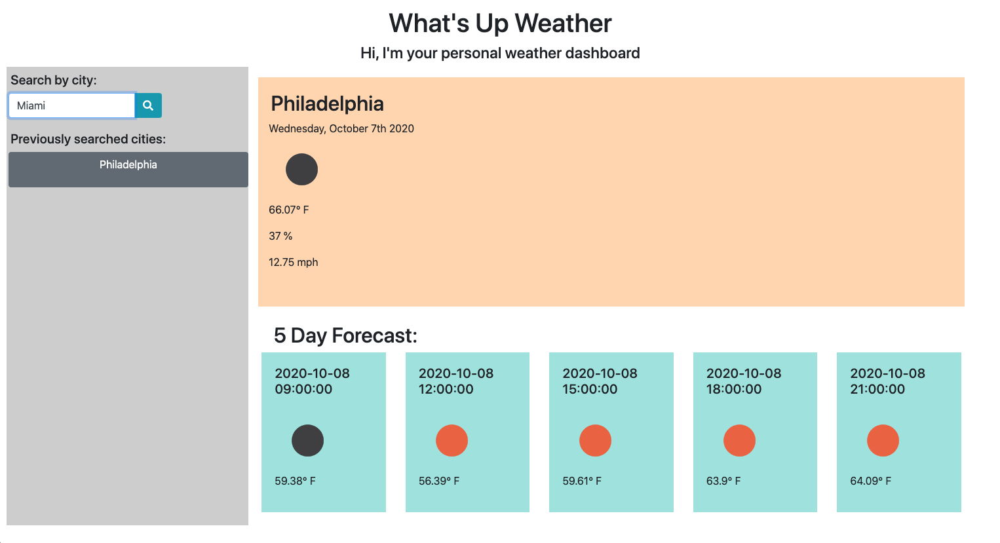

# Weather-Dashboard
This is a simple applicatoin that allows a user to search for a city and get the current weather and 5 day forecast.
After the user types in a city name, that city is automatically loaded into the user's search history through local storage, and appear as a handy list of buttons that the user can use to keep an eye on favorite cities. The search history buttons are kept to a maximum length of 8 cities, and duplicate entries are automatically filtered out.

# Coding Specifics
Must create a file in the asssets folder called keys.js which holds the api key.
Example: var APIKey = "0000000000";

This app will run in the browser and feature dynamically updated HTML and CSS powered by jQuery and a third-party API, OpenWeatherMap API, that allows access to weather data with specfic parameters to the URL - in this case, cities and 5-day forecast.

# Future Fixes
1) I would like to display the date in a more readable way for the five day forecast. Probably should implement moment.ja instead of pulling from the api itself.

2) Need to implement the UV index.

3) Fix responsiveness of page.

4) Fix local storage. Right now it displays my most recent city search on top of my previous city searches.

5) Fix design and clean it up